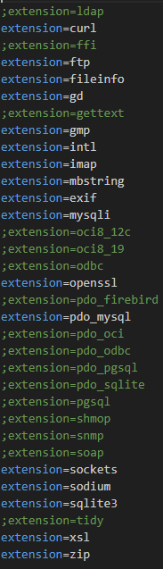

# YYAccount
A Simple Third-Party Auth System By Nyauzyolk😊

# Environments
Apache or Nginx + PHP 8.2 + MySQL 5.7.44 + Composer 2.8.9

# Extensions

# Commands
1. `copy .env.example .env`
2. `composer update`
3. `composer install --no-dev --optimize-autoloader`
4. `php artisan key:generate --force`
5. `php artisan migrate`

# Admin Commands
1. `php artisan admin:create`
2. `php artisan admin:delete`
3. `php artisan admin:list`
4. `php artisan admin:reset`

# License
This project is a free and Open Source project, and its sale or malicious dissemination is prohibited. Those who cause significant impact will be held responsible.
